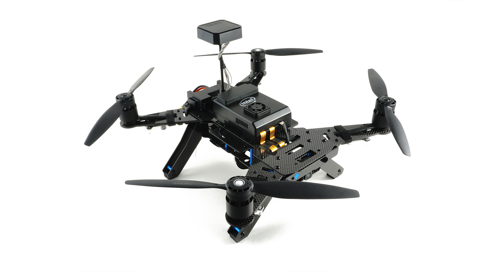
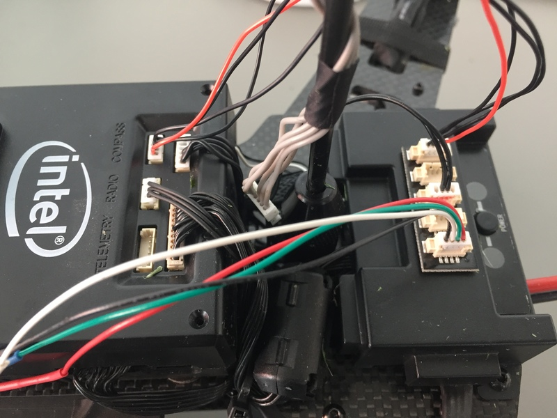

# Intel® Aero Ready to Fly 드론

The Intel® Aero Ready to Fly 드론은 UAV 개발 플랫폼입니다. 구성품 중에 [Intel Aero
Compute Board](https://software.intel.com/en-us/aero/dev-kit)은 쿼드코어 CPU를 가지고 있으며 Linux가 실행됩니다. 다른 구성품으로는 여기에 연결되는 STM32 마이크로컨트롤러가 있으며 NuttX 위에서 PX4가 실행됩니다. 이것들은 모두 [Intel® Aero Ready to Fly Drone](https://software.intel.com/en-us/aero/drone-dev-kit)에 패키징되어 있으며 비전 악세사리 킷도 포함되어 있습니다.



## 소개

주요 문서는 [official wiki](https://github.com/intel-aero/meta-intel-aero/wiki)를 참고하세요. 보드 셋업, 업데이트, 연결하는 방법이 포함되어 있습니다. 이전 릴리즈와 방법이 달라질 수 있으므로 최신 이미지로 업데이트하는 것이 중요합니다.

보드에 연결해서 BIOS와 distro 버전을 확인하기 위해 다음 명령을 실행합니다 :

```
get_aero_version.py
```

여기에 소개된 방법은 다음 버전에서 테스트를 진행했습니다 :

```
BIOS_VERSION = Aero-01.00.12_Prod
OS_VERSION = v01.00.04
```

공식문서에서는 Linux에서 어떻게 개발 방법도 설명하므로 여기서는 마이크로컨트롤러에 펌웨어를 업데이트하는 방법에 집중하도록 합니다.

## Flashing

PX4 개발 환경을 설정한 후에, 다음 단계를 따라 PX4 소프트웨어를 엡데이트합니다. :

1. Aero에 모든 소프트웨어를 최신으로 업데이트하기 (https://github.com/intel-aero/meta-intel-aero/wiki/Upgrade-To-Latest-Software-Release)

2. [Firmware](https://github.com/PX4/Firmware) 소스를 가져 오기

3. `make aerofc-v1_default` 명령으로 컴파일하기

4. 타겟 hostname을 설정하기

If your system resolves link local names you don't have to do anything and you can skip this step. You can test it by trying to ssh into intel-aero.local after connecting to it either via WiFi or USB:

```
ssh root@intel-aero.local
```

동작하지 않는 경우에는 업로드 스크립트로 사용할 IP로 시도해봅니다. :

```
export AERO_HOSTNAME=192.168.1.1`
```

5. `make aerofc-v1_default upload`로 업로드


## 네트워크로 QGroundControl 연결하기

1. WiFi나 USB 네트워크로 보드에 연결했는지 확인합니다.

2. 보드에 ssh로 연결하고 mavlink 포워딩이 실행되었는지 확인합니다. 기본적으로 부팅때 자동으로 시작됩니다. 다음 명령으로 수동으로 시작시킬 수 있습니다. :
```
/etc/init.d/mavlink-routerd.sh start
```

3. QGroundControl를 시작되면서 자동으로 연결됩니다.

4. QGroundControl를 시작하기 전에, [NuttX shell](../debug/system_console.md#mavlink-shell)을 시작 시키기 :
```
./Tools/mavlink_shell.py 0.0.0.0:14550
```

## Lidar Lite range finder 연결하기

여기서 소개하는 방법은 I2C로 Lidar Lite V3에 연결합니다. Aero(레이블은 compass)에 I2C 포트는 외부 magnetometer(GPS의 일부)로 사용합니다. 따라서 I2C splitter는 Lidar Lite를 연결하는데 사용해야 합니다.(사진 참조)



Lidar Lite V3용 핀아웃은 다음과 같습니다.

| pin | Aerofc I2C | Lidar Lite V3    |
| --- | ---------- | ---------------- |
| 1   | VCC        | VCC              |
| 2   | SCL        | - (Power enable) |
| 3   | SDA        | - (Mode control) |
| 4   | GND        | SCL              |
| 5   | -          | SDA              |
| 6   | -          | GND              |


